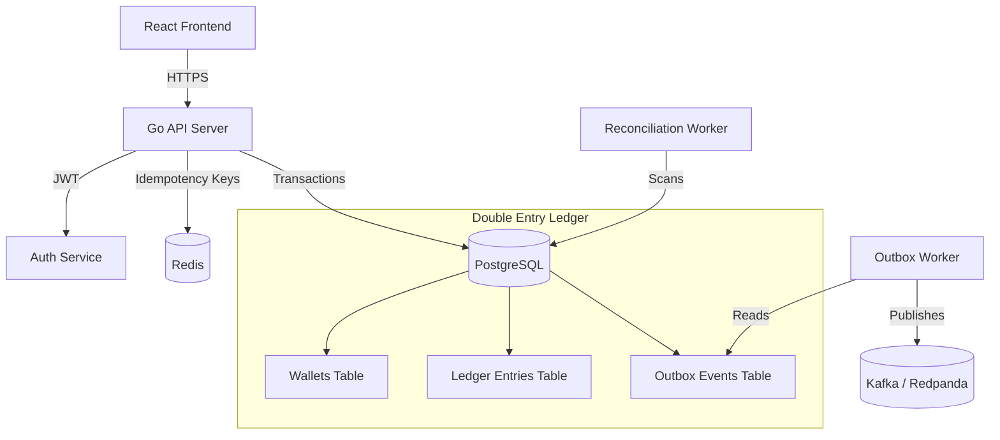

<div align="center">
  
  
  
  
  
  
  <h1>Core Banking Ledger & Wallet Engine</h1>
  <p><strong>A production-ready, highly concurrent, distributed financial ledger system built in Go.</strong></p>
</div>

<br />

## 📖 Overview

This repository contains a full-stack, enterprise-grade Wallet and Ledger system. It is designed to handle high-throughput financial transactions safely without losing data, preventing race conditions, and maintaining strict ACID compliance. 

Built around a **Double-Entry Ledger** architecture, this engine ensures that money is never created or destroyed out of thin air—only transferred between immutable accounts.

## ✨ Key Features

- **Double-Entry Ledger Architecture**: Financial records are strictly immutable. Every transfer creates perfectly balanced debit and credit entries.
- **Idempotency Engine**: Transfer APIs are completely safe from network retries. Using Redis, duplicate requests (e.g., a user double-clicking "Pay") are caught and securely rejected or returned with cached responses.
- **Event-Driven Architecture (Kafka & Outbox Pattern)**: Distributed messaging guarantees that services remain decoupled. Transfers safely generate events in Postgres (Outbox Pattern) that a background worker seamlessly publishes to Kafka (Redpanda).
- **Simulated Webhook Payments**: Handles simulated external Payment Gateway webhooks using HMAC-SHA256 signature verification.
- **Automated Financial Reconciliation**: A background worker continuously scans the ledger and wallet balances, comparing them to detect and report any system anomalies or data corruption.
- **Stunning Frontend Application**: A sleek, dark-themed, glassmorphic React frontend built with Vite, allowing users to securely manage wallets and transfer funds.
- **Fully Containerized**: The entire stack (Go API, Vite/React Frontend, Postgres, Redis, Kafka/Redpanda) spins up instantly using Docker Compose.

---

## 🏗️ System Architecture



---

## 🚀 Getting Started

### Prerequisites
- Docker and Docker Compose
- Git

### Installation & Setup

1. **Clone the repository:**
   ```bash
   git clone https://github.com/your-username/your-repo-name.git
   cd your-repo-name
   ```

2. **Start the Infrastructure:**
   Spin up the entire stack (Go API, NGINX Frontend, PostgreSQL, Redis, Redpanda) using Docker Compose:
   ```bash
   docker-compose up -d --build
   ```

3. **Access the Application:**
   - **Frontend UI**: [http://localhost:3000](http://localhost:3000)
   - **Backend API**: `http://localhost:8080/api/v1`

---

## 📂 Project Structure

- `/cmd/api` - The main entrypoint for the Go API server.
- `/internal` - Core domain logic.
  - `/ledger` - Double-entry ledger logic and structures.
  - `/wallets` - Wallet management and balances.
  - `/transfers` - Idempotent transfer execution and database locking.
  - `/outbox` - Transactional outbox worker for Kafka events.
  - `/reconciliation` - Background reconciliation worker.
- `/frontend` - The Vite/React web application.
- `/scripts` - K6 load testing scripts and development webhooks.
- `/db/migrations` - PostgreSQL Goose migrations.

---

## 🧪 Performance & Reliability

This system was battle-tested using `k6` to simulate high-throughput traffic. It successfully processes thousands of concurrent transactions while guaranteeing:
1. Row-level database locks (`SELECT FOR UPDATE`) to prevent deadlocks and race conditions.
2. Perfect Idempotency (preventing double charges).
3. Resilient event delivery via the Transactional Outbox pattern.

---

## 📄 License
This project is licensed under the MIT License - see the LICENSE file for details.
